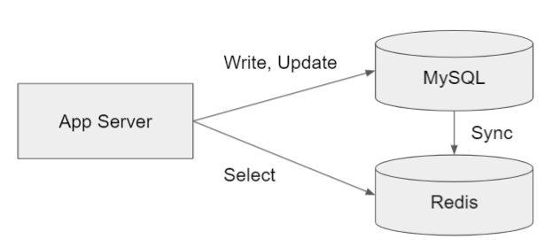
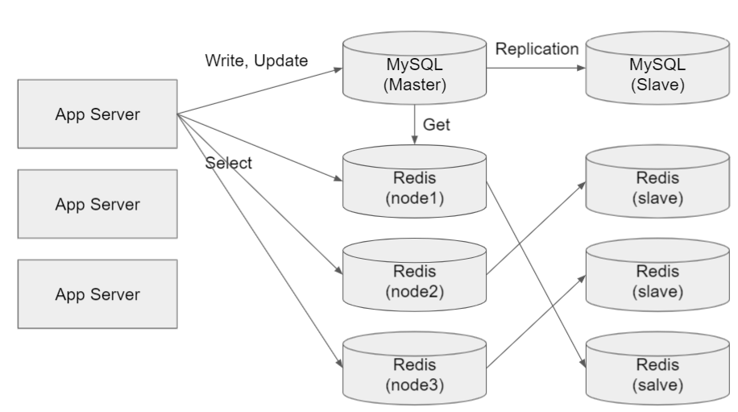

# Dev with Redis and MySQL

## Redis vs. Memcached


| | Redis |  Memcached |
| ---- | :----: | :----: |
| MySQL公式モジュール| ✘ | 〇 |
| Cluster | 〇 | ✘ |
| Sharding | 〇 | ✘
| HA | 〇 | ✘
| バックアップ | 〇 <BR> (RDB, AOF) | ✘ <BR> (MySQL連動のため不要)
| データタイプ | String, List, Set, Hash | String
| 用途 | メモリDBとして利用する目的。 ファイルにバックアップをしてRedisに直接復旧可能な構造 | MySQLのスピードを上げるためのSelect Cache目的
----

## Redisの特徴

* RDBMSのような並列処理が不可能
* データ構造はKVS(Key Value Store)
* Disk IO不要
* 構造定義不要
* データのCRUD可能
* 1Processは1Coreだけ使う(Multi Coreでは十分活用できない)

## Redis Cluster

* データシャーディング
* 同じデータを複数台に持たない
* Ver3.0からサポート
* https://www.sraoss.co.jp/tech-blog/redis/redis-cluster/


## Redis using MySQL

### Select

1. Select時RedisからSelect
2. Selectデータがない場合MySQLからSelect後Redisに更新 

### Update, Delete, Insert

1. Write, Update, Delete 時MySQLに反映
2. Redisの該当データを削除



## Service structure



## Code structure

```js
Call from redis
if(exists){
    step 1: return data;
}else{
    step 1: query MYSQL
    step 2: Save in redis
    step 3: return data
}
```

## Redis Data

* ユーザーSessionデータ
* ユーザー毎のアバター情報
* リスト等の多数のユーザーがよく呼び出すデータ
* JOINが必要な場合JOINした結果を入れる。
* 多数のテーブルの処理はApplication Layerで処理

## Reference

* Mysql-redis (npm)
    * https://www.npmjs.com/package/mysql-redis
* AWS Redis MySQL
    * https://aws.amazon.com/jp/getting-started/hands-on/boosting-mysql-database-performance-with-amazon-elasticache-for-redis/
* Spring MVC MySQL Redis
    * https://hayashier.com/article/springmvc-get-started/

